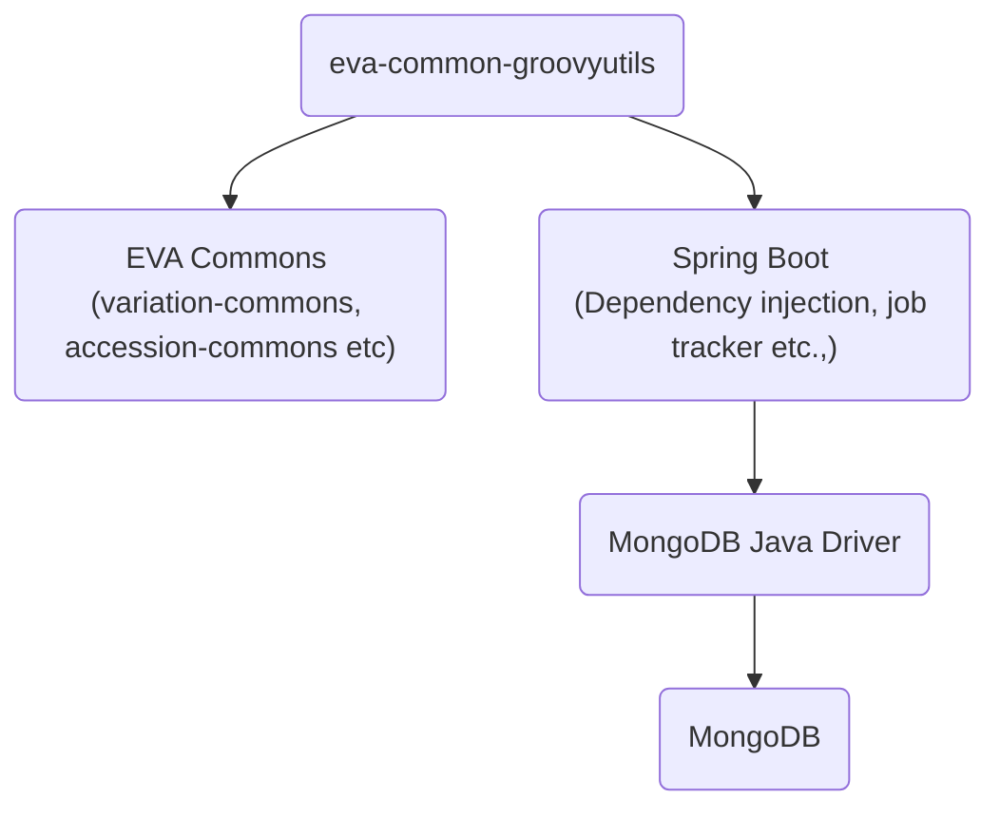

# eva-common-groovyutils
EBI EVA - Common Groovy Utilities

# Where does this library sit architecturally?

```mermaid
graph TB  
  evaCommons("EVA Commons \n(variation-commons, accession-commons etc)")
  groovyUtils("eva-common-groovyutils")
  springLayer("Spring Boot \n(Dependency injection, job tracker etc.,)")
  javaDriver("MongoDB Java Driver")
  mongoLayer("MongoDB")

  groovyUtils --> evaCommons
  groovyUtils --> springLayer
  springLayer --> javaDriver
  javaDriver --> mongoLayer
```
